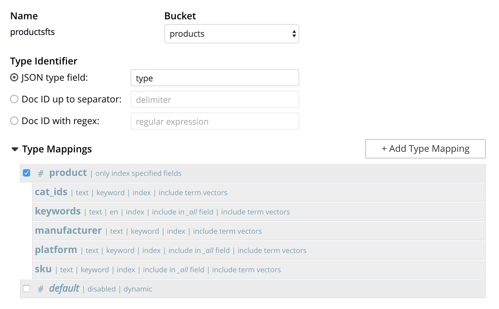
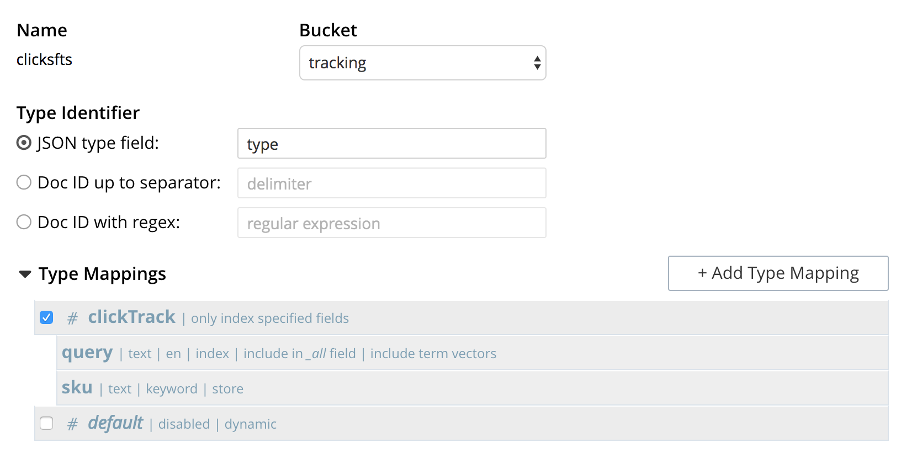

# Best Buy Example Setup Steps

**WORK IN PROGRESS**


## High Level Steps

1. Download best buy Kaggle dataset 
2. Transform the product data (from xml to json documents)
3. Create the buckets and full text indexes
4. Load the catalog
5. Start the best buy server
6. Run the simulation

Before beginning, get this repository:

```
go get github.com/ezeev/go-couchbase-examples/bestbuy
cd $GOPATH/src/github.com/ezeev/go-couchbase-examples/bestbuy
```

### 1. Download the BestBuy Dataset

Download the dataset here:

https://www.kaggle.com/c/acm-sf-chapter-hackathon-big

The files we care about are `product_data.tar.gz` and `train.csv`.

Download them to a location you will remember. Extract `product_data.tar.gz`.

### 2. Transform the Product Data

The BestBuy product data is in XML (thanks, 2011). In `bestbuy/py` there is a script named `build_json.py`. This will read the XML and parse it into one, giant jsonl file (line delimited json documents). We will need this to load the data later.

1. Edit `py/build_json.py`
2. Towards the top, modify lines 22 and 23 to point to where you extracted the product data:

```
xml_in_path = '/Users/evanpease/Development/datasets/product_data/products/*.xml'
jsonl_out_path = '/Users/evanpease/Development/datasets/product_data.jsonl'
```
### 3. Create the Buckets and FTS Indexes

In Couchbase, create the following buckets using default setting and the following memory allocations:

- `products` - 1 GB
- `sessions` - 256 MB
- `tracking` - 256 MB

Setup the FTS indexes using the following screenshots:
*(TODO: provide json FTS config w/ command line examples for FTS setup)*

#### Products FTS (productsfts)




#### Clicks FTS (clicksfts)




### 4. Load the Catalog

There's a simple program in `bestbuy/catloader` that will read the `.jsonl` file created in step 2 and load it into the products bucket.

```
go run catloader/main.go PATH_TO_BB_DATA/product_data.jsonl
```

Replace `PATH_TO_BB_DATA` with the path to your jsonl file.

While it is running, check the `products` bucket to make sure documents are being added.

### 5. Start the BestBuy Server

Before running, you will need to modify one Go file (TODO: load config form yaml instead):

In `bestbuy/exec/main.go`:

```go
	conf := bestbuy.Config{
		APIPort:                 8081,
		CouchbaseUserName:       "admin",
		CouchbasePassword:       "password123",
		CouchbaseClusterAddress: "couchbase://localhost",
		AssetsBaseUrl:           "http://localhost:8082",
		ProductsFTSIndexName:    "productsfts",
		TrackingFTSIndexName:    "clicksfts",
	}
```

Modify `CouchbaseUserName`, `CouchbasePassword` and `CouchbaseClusterAddress` if you are not running on localhost.

Then, finally start the server:

```
cd exec
go run main.go
```

Now you should be able to access the demo here:

http://localhost:8081/app/search?q=ipad


## Analytics (Optional)

Create an analytics bucket shadowing the tracking couchbase bucket:

`CREATE BUCKET trackingBucket WITH {"name":"tracking"};`

Create a datasets from the "clickTrack" and "queryTrack" docs in the tracking bucket:

```
CREATE DATASET clickTrack ON trackingBucket WHERE ``type`` = "clickTrack";
CREATE DATASET queryTrack ON trackingBucket WHERE `type` = "queryTrack";
```

Connect command will actually initiate the connection:

`CONNECT BUCKET trackingBucket;`

## Fun Analytical Queries

Most popular products:

```
select sku, sum(count) from clickTrack
group by sku
order by sum(count) desc
limit 100;
```

All searches that clicked on a SKU:

```
select query, sum(count) from clickTrack
where sku = '2842056'
group by query
order by sum(count) desc
limit 100;
```

Most popular searches:

```
select query, sum(count) from clickTrack
group by query
order by sum(count) desc
limit 100;
```

Most popular products for a given search:

```
select sku, sum(count) from clickTrack
where query = 'MacBook'
group by sku
order by sum(count) desc
limit 100;
```